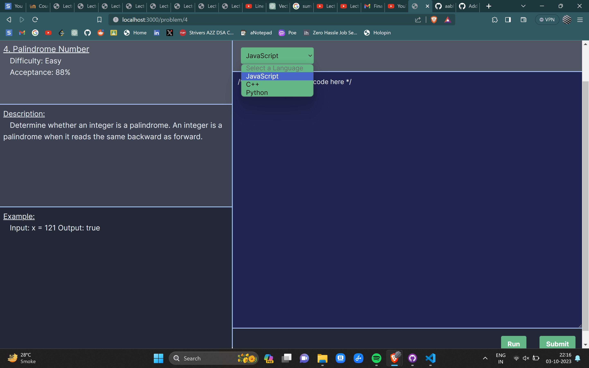

# CodeAbhi - Fullstack Web Application


Welcome to CodeAbhi, a dynamic web application built as a coding platform using Next.js, Express, Tailwind CSS, MongoDB, and Node.js.

## Table of Contents

- [Features](#features)
- [Installation](#installation)
- [Usage](#usage)
- [Screenshots](#screenshots)
- [How to Play](#howtoplay)
- [Contributing](#contributing)
- [License](#license)
- [Acknowledgments](#acknowledgments)
- [Author](#author)
## Features


- Seamless Signup and Login: Once logged in, stay authenticated until you decide to log out.

- Robust User Database: The database is automatically updated with each signup, maintaining a reliable and up-to-date user pool.

- Intelligent Warnings: Generates warnings for missing inputs, incorrect passwords, and existing email addresses during the signup process, ensuring a user-friendly experience.

- Problem Set Customization: The problem sets are customizable according to user preferences, stored securely in the MongoDB server.

- User-Exclusive Submissions: Only logged-in users can submit solutions to problems available on CodeAbhi.

- Randomized Code Review: CodeAbhi's code review process is currently randomized.

## Installation

1. Ensure you have Node.js installed.

2. Clone the project:

   ```bash
    git clone https://github.com/your-username/CodeAbhi.git
    cd CodeAbhi

3. Install dependencies:

    ```bash
    git clone https://github.com/aabbi15/sudoku_pygame.git
    cd sudoku_pygame

4. Run the application and backend

    ```bash
    npm run dev

## Usage

Run the application locally to explore and use CodeAbhi's features.

## Screenshots





## How to Use

- Create an account and login into CodeAbhi portal.
- Browse throught the problems and pick anyone
- Solve the problem in any preffered language and submit.
- View all your solutions from the submissions tab.
  
## Contributing

Contributions are always welcome!

Please let me know if you find any bug or issues.


## License

This project is licensed under the MIT License - see the `LICENSE` file for details.


## Acknowledgements

- Special thanks to the Harkirat Singh  to help me inspire and start my fullstack journey.

- Feel free to reach out to the me


## Author

- Name: Abhishek Abbi
- Github: [@aabbi15](https://www.github.com/aabbi15)
- Mail: abhishekabbi.work@gmail.com
- X: [@AbhishekAb70528](https://twitter.com/AbhishekAb70528)

